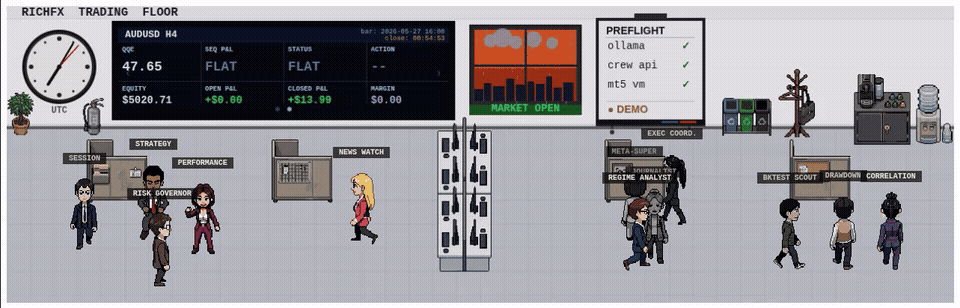

# RichFX Trading Floor

An AI-powered algorithmic trading monitoring system built around a 16-agent crew, a live MT5 bridge, a pixel-art trading floor dashboard, and Hermes — a conversational portfolio assistant accessible via Telegram. Agents analyse H4 signals in a sequential chain, advisory agents monitor risk conditions, and a centralised SQLite database accumulates decision history for pattern analysis.

> 🔴 **Live demo:** [crew.richielo.co](https://crew.richielo.co) *(Cloudflare Access — request access via the repo)*

---



## Hardware

All machines live in a **GeeekPi DeskPi RackMate Server T2 Cabinet**, with the trading floor dashboard displayed on a **GeeekPi 7.84" 1280×400 LCD Touchscreen** mounted in the rack — perfectly matching the canvas resolution of the dashboard.

| Device                                     | RAM            | Role |
|--------------------------------------------|----------------|------|
| Minisforum AI X1 470 Pro, Win 11           | 128GB          | EA development and MQL5 testing |
| Minisforum MS-S1 MAX, Ubuntu               | 128GB unified  | Ollama LLM inference, FastAPI crew API, Hermes Agent, Trading floor UI/dashboard |
| Minisforum AI N5 Pro NAS, Proxmox          | 96GB           | n8n automation, Win11 VM host |
| Minisforum AI N5 Pro NAS (via LXC), Win 11 | 8GB            | MT5 terminal, bridge, health server, Telegram alerter |
| Raspberry Pi 4B, Raspberry Pi OS           | 8GB            | Cloudflare tunnel → crew.richielo.co |

All machines connected via **Tailscale** mesh VPN.

---

## Architecture Overview

```
┌─────────────────────────────────────────────────────────────────┐
│  ubuntu-ai — Minisforum MS-S1 MAX (128GB)                       │
│  ├── Ollama (LLM inference)                 :11434              │
│  │     qwen3-14b-8k, deepseek-r1-14b-8k                         │
│  │     qwen25-14b-8k, gemma4-e4b-8k (~50GB loaded)              │
│  ├── FastAPI Crew API                       :8000               │
│  ├── Hermes Agent (hermes_agent.py)         via /ask            │
│  └── Trading Floor Dashboard               /ui/                 │
├─────────────────────────────────────────────────────────────────┤
│  NAS — Minisforum AI N5 Pro (96GB)                              │
│  ├── n8n Docker                             :5678               │
│  └── Win11 VM (LXC)                                             │
│        ├── MT5 Terminal + QQE_DCA EA                            │
│        ├── mt5_bridge.py    (state + DB writer)                 │
│        ├── vm_health.py     :8765                               │
│        ├── telegram_alerter.py  (alerts + Hermes inbound)       │
│        └── richfx.db        (centralised SQLite)                │
├─────────────────────────────────────────────────────────────────┤
│  Raspberry Pi                                                   │
│  └── Cloudflare Tunnel → crew.richielo.co                       │
└─────────────────────────────────────────────────────────────────┘
```

---

## Agent Roster

The trading floor has 13 agents across two phases:

### Phase 1 — Core LLM Chain (runs every H4 bar)

| Agent | Role | Model |
|-------|------|-------|
| **Regime Analyst** | Classifies market regime — RANGING / TRENDING / MIXED | qwen3-14b-8k |
| **Risk Governor** | Enforces hard risk rules — spread, drawdown, sequence limits | deepseek-r1-14b-8k |
| **Strategy Evaluator** | Scores signal quality 1-10, returns PROCEED or HOLD | qwen3-14b-8k |
| **Execution Coordinator** | Produces final action — open/add/close/no_action | qwen25-14b-8k |

### Phase 2 — Advisory Agents

| Agent | Role | Status |
|-------|------|--------|
| **Session** | Flags poor liquidity windows (off-peak hours) | ✅ Active |
| **Drawdown** | Monitors equity drawdown — warns at 2%, halts at 5% | ✅ Active |
| **Correlation** | Detects correlated USD exposure across pairs | ✅ Active |
| **News Watch** | ForexFactory calendar — blocks before high-impact events | ✅ Active |
| **Performance** | Tracks win rate and P&L from closed trade history | ✅ Active |
| **Backtest Scout** | Compares signals to 500-bar historical pattern database | ✅ Active |
| **Journalist** | Plain-English post-mortems on completed sequences | ✅ Active |
| **Meta-Supervisor** | Reviews crew decisions for systematic bias (needs 10+ bars) | ✅ Active |
| **Horizon** | Cross-pair signal quality analyst — recommends pair expansion | ✅ Active |
| **Timeframe Analyst** | Checks H8 trend alignment before H4 entries — flags counter-trend DCA | ✅ Active |
| **Volatility Guard** | ATR-based spike detection — flags abnormal volatility conditions | ✅ Active |

### Planned Agents

| Agent | Role | Status |
|-------|------|--------|
| **Sequence Advisor** | Intelligent open sequence management — early close recommendations | 🔲 Planned |

---

## The Trading Floor


## Agent Cast

| <sub>Regime Analyst</sub> | <sub>Risk Governor</sub> | <sub>Exec Coordinator</sub> | <sub>Strategy</sub> |
|:---:|:---:|:---:|:---:|
|  |  |  |  |

| <sub>Performance</sub> | <sub>Session</sub> | <sub>Correlation</sub> | <sub>Drawdown</sub> |
|:---:|:---:|:---:|:---:|
|  |  |  |  |

| <sub>News Watch</sub> | <sub>Journalist</sub> | <sub>Bktest Scout</sub> | <sub>Meta-Super</sub> |
|:---:|:---:|:---:|:---:|
|  |  |  |  |

| <sub>Horizon</sub> | <sub>Timeframe</sub> | <sub>Volatility</sub> | <sub>Sequence Advisor</sub> |
|:---:|:---:|:---:|:---:|
|  |  |  |  |

### Coming Soon

#### Sequence Advisor
> **Sequence** (`sqadv`) — Monitors open sequences and recommends early closes when conditions deteriorate. Requires 20+ completed sequences.

---

## API Endpoints

All served by FastAPI on port 8000.

| Endpoint | Method | Description |
|----------|--------|-------------|
| `/health` | GET | Liveness check |
| `/symbols` | GET | Active trading pairs from config |
| `/state` | GET | Current market state for a symbol (5 min cache) |
| `/analyse` | POST | Run full crew analysis (n8n only — never dashboard) |
| `/last-analysis` | GET | Most recent cached crew result (persisted to disk) |
| `/history` | GET | Closed trade history from MT5 |
| `/performance` | GET | Aggregated performance stats by symbol/account |
| `/bars` | GET | Historical bar data with signals from SQLite |
| `/decisions` | GET | Crew decision log from SQLite |
| `/sequences` | GET | Completed sequence records from SQLite |
| `/journalist` | GET | Recent sequence narratives |
| `/scout` | GET | Run Backtest Scout live signal analysis |
| `/scout/recommend` | POST | Scout Mode 2a — parameter sweep plan from .set file |
| `/scout/analyse` | POST | Scout Mode 2b — results analysis from optimisation CSV |
| `/meta` | GET | Run Meta-Supervisor analysis |
| `/animate` | POST | Queue alt gesture for some agents |
| `/live` | GET | Live account + open positions from MT5 (no cache, proxied from vm_health) |
| `/ask` | POST | Hermes conversational query — natural language portfolio questions answered by gemma4-e4b-8k |
| `/pending-animation` | GET | Dashboard polls for queued animations |
| `/horizon` | GET | Run Horizon cross-pair analysis (~30s, runs every H4 bar via n8n) |
| `/horizon/last` | GET | Most recent cached Horizon result (instant) |
| `/bars/symbols` | GET | All symbol/timeframe pairs in the bars DB |

---

## Data Flow

```
MT5 EA (Win11 VM) — runs independently, manages trades
    │
    └── mt5_bridge.py (every H4 bar)
            ├── writes state_EURUSD_H4.json
            ├── writes state_AUDUSD_H4.json
            ├── writes history.json (all closed deals)
            ├── seeds richfx.db bars table (500 bars + backfill)
            ├── appends new bar on each close
            └── seeds bars for monitoring-only pairs (magic=0, no EA)
                11 symbols × H1/H4/H8 — GBPUSD, USDJPY, EURGBP, NZDUSD,
                USDCAD, GBPJPY, XAUUSD, GBPAUD, EURJPY, EURCAD + EURUSD H1/H8

n8n (NAS) — sole trigger for analysis, fires on H4 bar schedule
    │
    └── POST /analyse → crew_api.py (ubuntu-ai)
            ├── SSH fetch state JSON from VM
            ├── 4-agent LLM chain (Ollama, ~4 min)
            ├── pure-Python checks (sess, dd, corr, news)
            ├── check_timeframe_alignment() — H8 trend vs H4 entry direction
            ├── check_volatility() — ATR ratio vs 30-bar average
            ├── cache result in memory + persist to disk
            ├── write decision to richfx.db via SSH
            ├── detect sequence close → trigger Journalist
            └── send Telegram alert (Shikigami)

Dashboard (browser) — read-only, never triggers /analyse
    ├── GET /state           (market data, TV screen)
    ├── GET /last-analysis   (agent states, instant from cache)
    ├── GET /performance     (closed trade stats)
    ├── GET /scout           (pattern confidence score)
    ├── GET /journalist      (sequence narratives)
    ├── GET /horizon/last    (pair expansion recommendations, cached — n8n refreshes every H4 bar)
    ├── GET /live              (live P&L + positions, polls 30s)
    ├── GET /live              (live P&L + positions, polls 30s)
    └── GET /pending-animation (alt gesture queue, polls 3s)
```

---

## Hermes — Conversational Portfolio Assistant

Hermes is a CrewAI agent (`qwen3-14b-8k`) accessible via the Shikigami Telegram bot.
Send any natural language message to the bot and Hermes will fetch the relevant data
and answer. Stateful — maintains a rolling 5-turn conversation history per session.

**Security:** Hermes only responds to messages from `TELEGRAM_ALLOWED_UID` (set in `.env`).
All other senders are silently ignored.

**Tools available to Hermes:**

| Tool | Data source | Example question |
|------|-------------|-----------------|
| `get_live_portfolio` | `/live` | "What is my open P&L?" |
| `get_last_analysis` | `/last-analysis` | "What does the crew think about EURUSD?" |
| `get_performance` | `/performance` | "What is my win rate this month?" |
| `get_horizon` | `/horizon/last` | "Which pairs look best right now?" |
| `get_signal_state` | `/state` | "What is the QQE on AUDUSD?" |
| `trigger_analysis` | `POST /analyse` | "Run analysis on EURUSD" |
| `trigger_horizon` | `GET /horizon` | "Run a fresh Horizon scan" |
| `trigger_scout` | `GET /scout` | "What is the pattern confidence?" |

**Concurrency:** Hermes runs on its own executor and lock — queries run concurrently
with H4 analysis. If analysis is running when a query arrives, Hermes notes this
in its reply but still answers.

**Flow:**
```
Telegram message → telegram_alerter.py (UID check)
    → POST /ask → crew_api.py
        → hermes_agent.py (CrewAI agent, qwen3-14b-8k)
            → tool calls as needed
        → plain text reply
    → Telegram reply
```

---

## Database Schema (richfx.db on Win11 VM)

```sql
bars        — OHLCV + QQE/MACD signals, all pairs/timeframes (500 bars seeded)
decisions   — crew decision per bar (regime, risk, strategy, action, spread)
sequences   — completed sequence records with Journalist narratives
```

Adding a new pair to `symbols.json` automatically populates all three tables — no schema changes required.

---

## Configuration

### `config/symbols.json`
Defines active trading pairs. Add an entry and restart to activate.

```json
{
  "symbols": [
    {
      "symbol": "EURUSD",
      "timeframe": "H4",
      "magic": 100401,
      "account": "demo",
      "active": true,
      "label": "Euro / US Dollar"
    }
  ]
}
```

### `config/correlations.json`
Correlation matrix for the Correlation agent. Reloaded on every analysis — no restart required.

### `.env` (not committed)
```
TELEGRAM_TOKEN=your_bot_token_from_botfather
TELEGRAM_CHAT_ID=your_outbound_chat_id
TELEGRAM_ALLOWED_UID=your_telegram_user_id_from_userinfobot
CREW_API_URL=http://<ubuntu-ai-tailscale-ip>:8000
OLLAMA_BASE_URL=http://localhost:11434
```

`TELEGRAM_ALLOWED_UID` locks Hermes to your Telegram account only. Get it from @userinfobot. Never commit this file.

---

## Dashboard Features

**Access:**
- Local: `http://localhost:8000`
- Tailscale: `http://<ubuntu-ai-tailscale-ip>:8000`
- Public: `https://crew.richielo.co` *(Cloudflare Access — email OTP)*

**Features:**
- 16 pixel-art agents with walk/stand/action/cheer/cry/anxious animations
- TV screen: QQE, sequence P&L, open P&L, closed P&L, equity, margin
- Open P&L and sequence P&L refresh every 30 seconds via live MT5 poll (not bar-close dependent)
- TV screen auto-rotates across active pairs every 30 seconds (pauses on manual click)
- UTC analogue clock, market open/closed indicator
- Dynamic dusk/dawn using SunCalc.js — accurate sunrise/sunset for your location
- Weather system (sun/cloud/rain), night overlay
- Agent overlay panels with LLM summary and full output
- Alt gesture animation — some agents zoom from bottom on request
- Analysis cache persisted to disk — agents active instantly after restart
- Automatic 5-minute data refresh (n8n owns analysis trigger)
- Timeframe Analyst — H8 alignment check on every H4 analysis
- Volatility Guard — ATR ratio vs 30-bar average on every analysis
- Horizon — H4 and H1 rankings shown in overlay, refreshes every bar
- Hermes (Shikigami) — conversational Telegram interface for natural language portfolio queries, action triggers (analysis, horizon, scout), and stateful conversation with rolling 5-turn memory

---

## Sprite Conventions

All character sprites are 112×112px GIFs with transparent backgrounds.

Each agent requires these animation files:
```
{agent}_stand_south/north/east/west.gif
{agent}_walk_south/north/east/west.gif
{agent}_cheer.gif   {agent}_cry.gif
{agent}_point.gif   {agent}_anxious.gif
{agent}_alt.gif     (some agents only — zoom gesture)
```

---

## Security

- **Tailscale** — all API endpoints accessible only within the mesh
- **Cloudflare Access** — public dashboard requires email OTP
- **Read-only dashboard** — no write operations via public URL
- **n8n-only analysis** — `/analyse` never called by the dashboard
- **Credentials in `.env`** — never committed to repo

---

## Docs

- [ARCHITECTURE.md](docs/ARCHITECTURE.md) — system architecture, data flow, security model
- [AGENTS.md](docs/AGENTS.md) — per-agent documentation, models, output formats
- [ROADMAP.md](docs/ROADMAP.md) — completed work, pending items, architecture decisions
- [SETUP.md](docs/SETUP.md) — installation guide for all machines

---

## Licence

MIT
